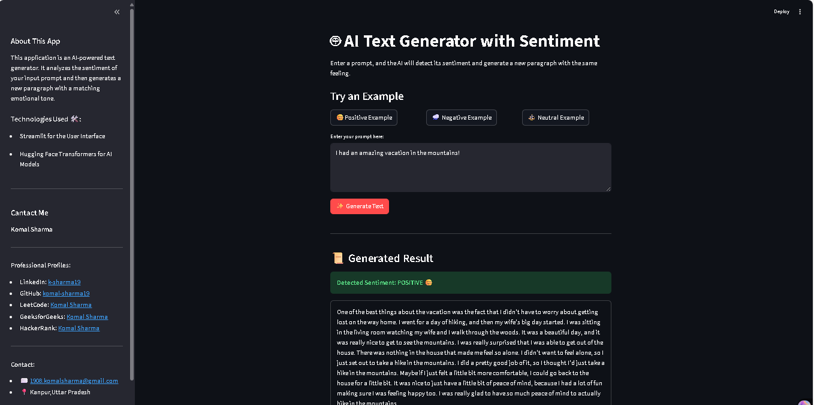

# AI Text Generator with Sentiment 🤖

  

An interactive web application that analyzes the sentiment of a user's prompt and generates a new, sentiment-aligned paragraph using advanced NLP models.

---

## 📸 Screenshot

*Add a screenshot of your final application here. This is a crucial step to showcase your work.*



---

## Demo
https://aitextgenerator.streamlit.app/

## ✨ Key Features

* **Sentiment Analysis**: Automatically detects if the input text is **Positive**, **Negative**, or **Neutral**.
* **Sentiment-Aligned Text Generation**: Creates a coherent paragraph that matches the detected emotional tone.
* **Interactive UI**: A clean and engaging user interface built with Streamlit, featuring a custom background and styled components.
* **Example Prompts**: One-click buttons to test the application with pre-filled positive, negative, and neutral examples.
* **Informative Sidebar**: Contains details about the project, the technologies used, and the author's contact information.

---

## 🛠️ Technologies Used

* **Backend**: Python
* **Frontend**: Streamlit
* **NLP Models**: Hugging Face Transformers
    * **Sentiment Analysis**: `distilbert-base-uncased-finetuned-sst-2-english`
    * **Text Generation**: `gpt2`

---

## ⚙️ Setup and Installation

To run this project locally, please follow these steps:

**1. Clone the Repository**
```bash
git clone [https://github.com/your-github-username/your-repo-name.git](https://github.com/your-github-username/your-repo-name.git)
cd your-repo-name
```

**2. Create and Activate a Virtual Environment**
* **Windows:**
    ```bash
    python -m venv venv
    .\venv\Scripts\activate
    ```
* **macOS / Linux:**
    ```bash
    python3 -m venv venv
    source venv/bin/activate
    ```

**3. Install Dependencies**
```bash
pip install -r requirements.txt
```

**4. Run the Streamlit App**
```bash
streamlit run app.py
```
The application will open in your default web browser.

---

## 🗂️ Project Structure

```
.
├── app.py                   # The main Streamlit application script
├── requirements.txt         # List of Python dependencies
├── sentiment-analysis.jpg   # Background image for the UI
└── README.md                # This file
```

---

## 🤔 Challenges & Learnings

**Base64** string and embedding it directly into the CSS via an f-string, ensuring it's self-contained and works upon deployment.
* **Output Relevance**: The initial text generation model (`gpt2`) included the entire input prompt in its output, making the results irrelevant. This was solved by programmatically cleaning the generated text to remove the prompt, leaving only the newly created content.

---

## 👤 Author

**Komal Sharma**

- **LinkedIn**: [@k-sharma19](https://www.linkedin.com/in/k-sharma19/)
- **GitHub**: [@komal-sharma19](https://github.com/komal-sharma19)
- **Email**: `1908.komalsharma@gmail.com`
